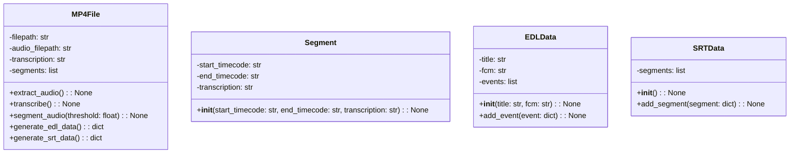

```mermaid
classDiagram
    class MP4File {
        -filepath: str
        -audio_filepath: str
        -transcription: str
        -segments: list
        +extract_audio(): None
        +transcribe(): None
        +segment_audio(threshold: float): None
        +generate_edl_data(): dict
        +generate_srt_data(): dict
    }
    class Segment {
        -start_timecode: str
        -end_timecode: str
        -transcription: str
        +__init__(start_timecode: str, end_timecode: str, transcription: str): None
    }
    class EDLData {
        -title: str
        -fcm: str
        -events: list
        +__init__(title: str, fcm: str): None
        +add_event(event: dict): None
    }
    class SRTData {
        -segments: list
        +__init__(): None
        +add_segment(segment: dict): None
    }
```
