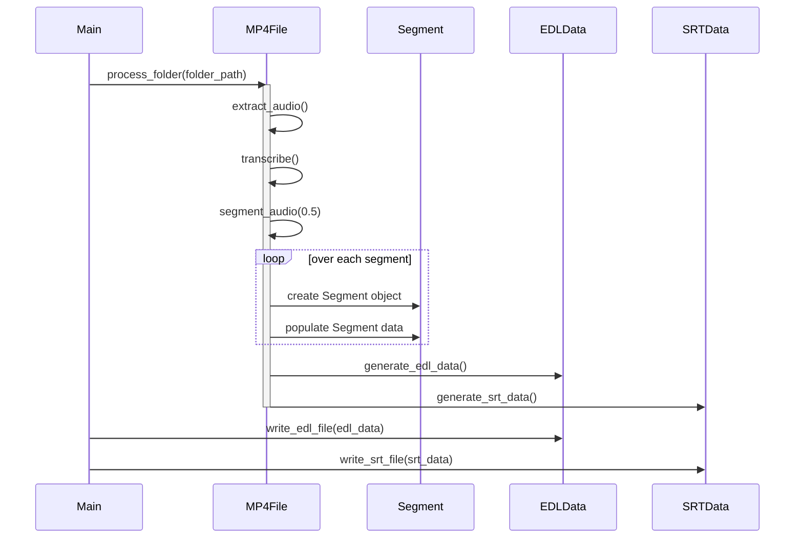

```mermaid
sequenceDiagram
    participant Main as Main
    participant MP4File as MP4File
    participant Segment as Segment
    participant EDLData as EDLData
    participant SRTData as SRTData
    Main->>MP4File: process_folder(folder_path)
    activate MP4File
    MP4File->>MP4File: extract_audio()
    MP4File->>MP4File: transcribe()
    MP4File->>MP4File: segment_audio(0.5)
    loop over each segment
        MP4File->>Segment: create Segment object
        MP4File->>Segment: populate Segment data
    end
    MP4File->>EDLData: generate_edl_data()
    MP4File->>SRTData: generate_srt_data()
    deactivate MP4File
    Main->>EDLData: write_edl_file(edl_data)
    Main->>SRTData: write_srt_file(srt_data)
```
