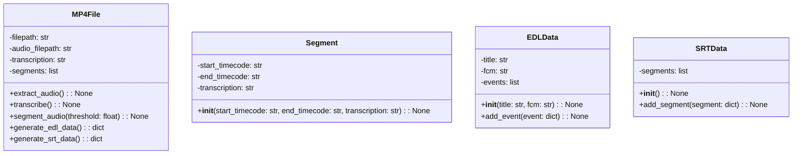
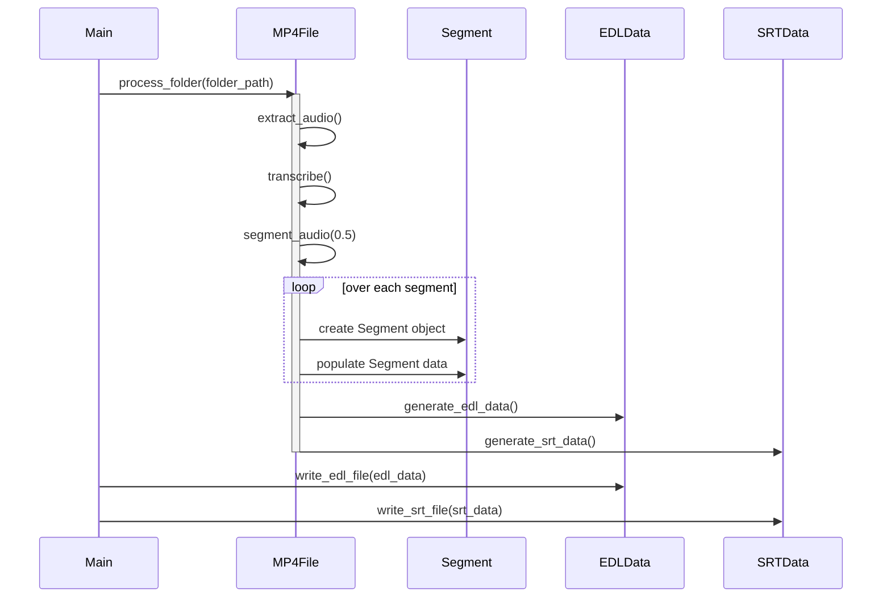

## Implementation approach

We will use Python's `subprocess` module to interact with FFmpeg, the `whisper` library for transcription, and custom functions for time code manipulation and EDL/SRT generation.  Error handling will be implemented using `try...except` blocks to catch potential issues with file access, FFmpeg execution, Whisper API calls, and time code parsing.  A clear structure will be used to manage data flow and ensure robustness.

## File list

- main.py

## Data structures and interfaces

## Program call flow

## Anything UNCLEAR

The exact format for handling different file names (e.g., how to extract the filename from the input MP4 file) and specific error handling mechanisms (e.g., how to handle cases where Whisper fails to transcribe) need further clarification.  Also, the input folder structure and expected file naming conventions should be defined.

