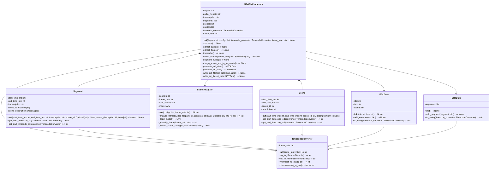
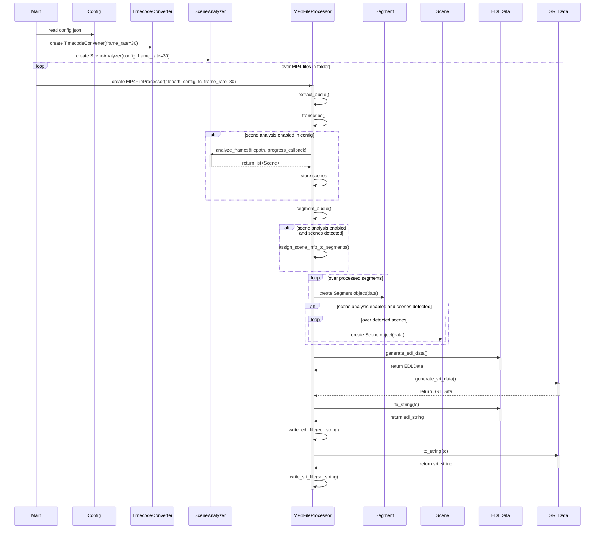

## Refined Implementation Approach

We will implement the solution using Python, leveraging the `subprocess` module for interacting with FFmpeg for audio extraction and frame extraction. OpenAI's `whisper` API or the `whisper` library will be used for transcription. A dedicated `timecode_utils.py` module will handle time code manipulation and conversion between milliseconds, HH:MM:SS:FF (30fps non-drop frame for EDL), and HH:MM:SS,MMM (for SRT). Scene analysis will be implemented within a `scene_analysis.py` module using a `SceneAnalyzer` class. This class will use OpenCV (`cv2`) for frame extraction from the video file, potentially analyzing frames at a configurable rate (e.g., every Nth frame) to balance speed and accuracy. A pre-trained image classification model (details TBD, potentially leveraging libraries like PyTorch or TensorFlow) will be used to analyze extracted frames. Scene boundaries will be detected based on significant changes in classification results over consecutive analyzed frames. The `SceneAnalyzer` will include logic for reporting progress during frame analysis via a callback function provided by the main processing loop. Segmentation will primarily be silence-based using audio analysis (e.g., with `pydub` or similar libraries), resulting in initial segments with start and end timecodes. The detected scenes from the `SceneAnalyzer` will then be used to enrich these silence-based segments by assigning the relevant scene ID and description based on timecode overlap. EDL and SRT files will be generated using custom functions or classes (`EDLData`, `SRTData`) that format the data according to standard specifications. Scene metadata will be embedded in the output files; for EDL, this will be via comment lines (`* COMMENT Scene ID: X, Description: Y`) placed before the corresponding event line. For SRT, it will be included within the text block of each segment, likely on a new line or prefixed (e.g., `[Scene ID: X, Description: Y]\nTranscription text...`). Robust error handling using `try...except` blocks will manage issues during file operations, external process execution (FFmpeg, OpenCV), API calls (Whisper), model loading/execution, and data processing. Configuration will be managed via a `config.json` file, allowing users to enable/disable scene analysis, set parameters like silence thresholds, frame analysis rate, and potentially specify model details or paths. Logging will be integrated using Python's `logging` module to record events, warnings, and errors throughout the process. The main script (`main.py`) will iterate through MP4 files in the input folder, orchestrating the processing pipeline for each file, including initializing the `TimecodeConverter` and `SceneAnalyzer` and managing the `MP4FileProcessor` instance for each video.

## Refined File list

- main.py
- scene_analysis.py
- config.json
- timecode_utils.py

## Refined Data structures and interfaces

## Refined Program call flow

## Anything UNCLEAR

The exact format for embedding scene information in EDL and SRT files is proposed as EDL comments (`* COMMENT Scene ID: X, Description: Y`) and inclusion within the SRT text block (`[Scene ID: X, Description: Y]\nTranscription text...`), but this needs final confirmation based on user feedback or standard practices if available. The level of detail and type of description for scene information depends heavily on the chosen image classification model and its capabilities (e.g., simple labels vs. more complex descriptions). Balancing analysis speed and accuracy, especially for long videos or rapid scene changes, is a practical challenge; this will be addressed by making the frame analysis rate configurable (e.g., analyzing every Nth frame). Specific pre-trained models suitable for general scene classification in diverse video content, their licensing, and download mechanisms are still TBD and require further research.

